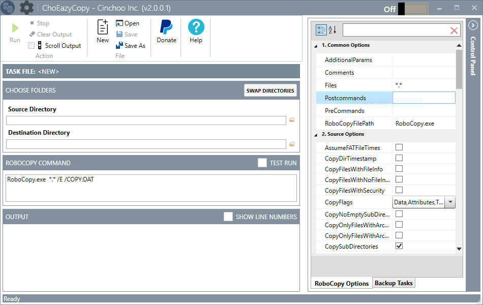
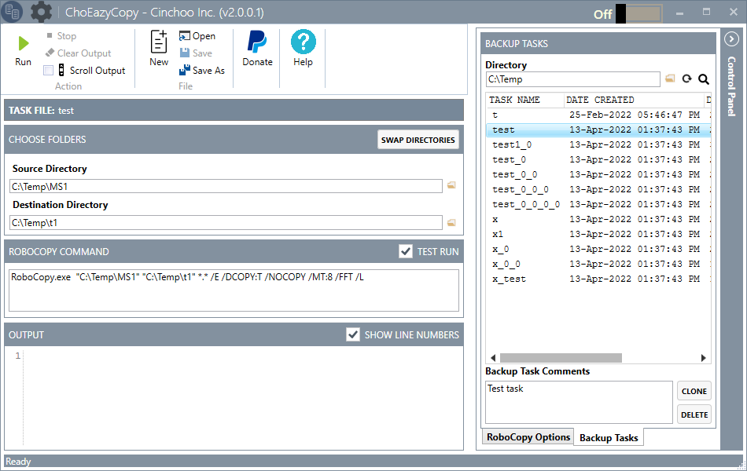

# ChoEazyCopy, a RoboCopy GUI
Simple and powerful GUI to the Microsoft RoboCopy tool
RoboCopy is a powerful tool included in Microsoft Windows Server that is used to perform more advanced file replication tasks. The biggest benefit you'll find is the ability to create full mirror duplicates of two file structures (including all subdirectories and files, if you choose). RoboCopy also allows you to preserve all of the associated file information, including date and time stamps, security access control lists (ACLs) and more, which is missing from normal file copy operations.

For people who like to work with the command line, RoboCopy.exe, as it is, is great enough for them. However for those who are comfortable to work with a GUI, here is EazyCopy, a simple and intuitive GUI tool for the RoboCopy command.

This tool is developed using Cinchoo - An application framework for .NET. It is another working example of using some of the key features of the Cinchoo framework.

Features:

* Simple and intuitive GUI.
* Compose and Save the options as a profile for reuse.
* Run multiple instances.
* Run and launch from Windows System Tray
* Provides a text box with RoboCopy commands associated with the changes to the properties.
* Display immediate hints for an option highlighted in the property grid or in the text editor.
* The ability to run the RoboCopy within the GUI.

 
#### To read more about this tool, please refer to the CodeProject article below

[Cinchoo - EazyCopy, yet another RoboCopy GUI](http://www.codeproject.com/Articles/988605/Cinchoo-EazyCopy-yet-another-RoboCopy-GU)

## Binaries can be downloaded from 

[Download Binaries](https://github.com/Cinchoo/ChoEazyCopy/releases)

### This software requires .NET Framework 4 / .NET Framework 4.5.2

[.NET Framework 4](https://www.microsoft.com/en-us/download/confirmation.aspx?id=17718)

[.NET Framework 4.5.2](https://www.microsoft.com/en-us/download/details.aspx?id=42642)

If this project helps you be more productive, you can give me a cup of coffee :)

[$10](https://buy.stripe.com/8wM7u54Gk2SQ4us001)/[$25](https://buy.stripe.com/8wMdSt5KogJGf969AE)/[$50](https://buy.stripe.com/28o5lX4Gk652e527su)/[$100](https://buy.stripe.com/eVa3dP2ycbpm0ec6or)

